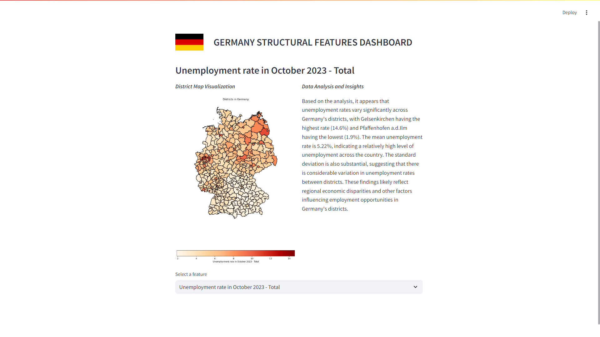
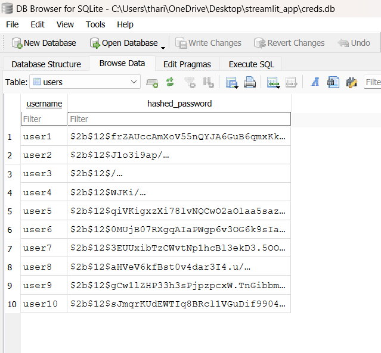

## Databases and Internet Technologies - Group Project - Group 2
### Group Members:
- Fengjie Yuan
- Jan Bernd Hagemann
- Jiayu Li
- Sophie Matwijow
- Thariq Mohamed Ali

## 1. Overview

This Streamlit app is designed for visualizing structural features of Germany's districts. It provides a user interface for login, registration, and an interactive dashboard that visualizes data and generates insights using Ollama's AI analysis.

---

### 2. App Structure

1. **app.py**: The main application file that sets up the page structure, handles session state, and manages page navigation (login or dashboard).
2. **login.py**: Handles user authentication (login and registration) using an SQLite database for storing credentials.
3. **dashboard.py**: Displays data visualizations (maps) and provides AI-powered insights using Ollama.
4. **ollama.py**: Integrates with Ollama's API to generate insights based on selected data features.

---

### 3. Directory Structure

```plaintext
├── app.py
├── login.py
├── dashboard.py
├── ollama.py
├── resources/
│   ├── whu_logo.png
│   ├── german_flag_icon.png
│   ├── ew24_structure_data.xlsx
│   ├── VG2500_KRS.shp
├── creds.db
└── README.md
```

---

## 4. Code Breakdown

### `app.py`

- **Functionality**: 
  - Initializes session variables for first-time visitors and user login status.
  - Directs the user to either the login page or the main dashboard based on the login status.
  - Refreshes the page on the first visit to resolve a UI issue.
  
- **Key Functions**:
  - `main()`: The main function that runs the app, handles session state, and directs the user to login or dashboard pages.

### `login.py`

- **Functionality**:
  - Manages user authentication by storing credentials in an SQLite database and checking them during login.
  - Allows users to register new accounts and handles cases where the username is already taken.
  
- **Key Functions**:
  - `init_db()`: Initializes the SQLite database with a `users` table to store usernames and hashed passwords.
  - `load_creds(username)`: Fetches hashed password for a given username from the database.
  - `check_creds(username, password)`: Validates the entered password against the stored hashed password.
  - `register_user(username, password)`: Registers a new user and stores their hashed password in the database.
  - `main_login()`: Displays either the login or registration page based on the session state.

### `dashboard.py`

- **Functionality**:
  - Displays a map of German districts with visualized data for a selected feature.
  - Provides summary statistics and insights for the selected feature using the Ollama API.
  
- **Key Components**:
  - `plot_map(feature_column, germany_map)`: Plots a map of German districts using the selected feature and Matplotlib.
  - `get_district_name(district_id)`: Retrieves the name of a district based on its ID.
  - `main_dashboard()`: Displays the dashboard with a dropdown to select a feature and visualize its distribution across German districts. It also generates insights using Ollama.

### `ollama.py`

- **Functionality**:
  - Connects to the Ollama API to generate AI-powered insights based on the selected data feature.
  - Handles API requests and processes the response.
  
- **Key Functions**:
  - `ask_ollama(selected_feature, max_value, min_value, max_district, min_district, val_summary)`: Sends a prompt to the Ollama API and returns a short analysis of the selected feature.

---

## 5. Technology Stack

- **Front-end**: Streamlit
- **Back-end**: Python, SQLite (for user authentication)
- **Data Visualisation and Analysis**: Matplotlib, Ollama API

---

## 6. How to Use

1. **Login/Register**: 
   - Users must either log in with existing credentials or register a new account.
2. **Dashboard**: 
   - Once logged in, users can select a feature from the dropdown to visualize its distribution across German districts.
   - The map is displayed on the left side, and AI-powered insights are generated on the right side using Ollama.

---

## 7. Files and Resources

- **Database**: `creds.db` - SQLite database for storing user credentials.
- **Resources**:
  - `resources/whu_logo.png` - Logo displayed on the login and registration pages.
  - `resources/ew24_structure_data.xlsx` - Excel file containing the data to be visualized.
  - `resources/VG2500_KRS.shp` - Shapefile containing the boundaries of German districts.
  - `resources/german_flag_icon.png` - Icon displayed on the dashboard.

---

## 8. API Integration

The application integrates with the Ollama API to provide insights on the selected feature:

- **URL**: `http://localhost:11434/api/generate`
- **Model**: `"llama3.1:latest"`
- **Request Data**: A prompt containing the selected feature, its max/min values, district names, and summary statistics.
- **Response**: A short analysis of the feature's distribution across German districts.

---

## Installation Instructions

1. Install dependencies using the following command:
   ```bash
   pip install streamlit matplotlib pandas geopandas bcrypt requests openpyxl
   ```
2. Run the Streamlit app:
   ```bash
   streamlit run app.py
   ```
3. Ensure that the Ollama API is running and accessible at the correct URL.

---

## Conclusion

This application provides an interactive interface for visualizing data and leveraging AI for insights. It is a part of the Databases Group Project and demonstrates the integration of data analysis, user authentication, and API interaction in a streamlined dashboard.

---

## Credits

Created by Group 2 as part of the **Databases course** at WHU - Otto Beisheim School of Management.

---

## Screenshots




